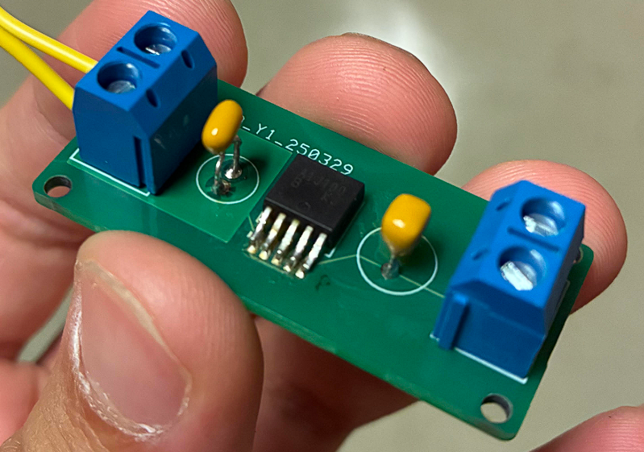
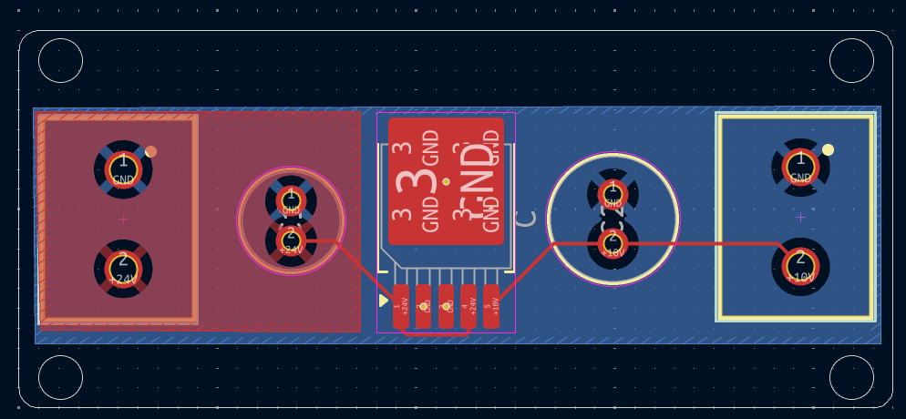
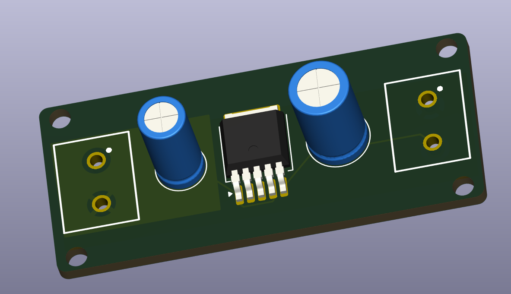

# 24 V → 10 V LDO Regulator Board

A small two-layer linear regulator board that takes a 24 V input on a screw terminal and delivers a fixed 10 V output on a second screw terminal. Built in KiCad 8, fabricated, and hand-assembled during my sophomore year for Texas Guadaloop at UT Austin.

The circuit is deliberately simple. The point of the project was to carry one board through the entire hardware flow: part selection from a manufacturer datasheet, schematic capture, custom symbol and footprint creation, layout, design review with more experienced peers, gerber export, fabrication, assembly, and bring-up, rather than to build something complex. 

This board was used for powering the hyperloop pod's safety lights.

---

## Board at a glance

| | |
|---|---|
| Input | 24 V, 2-pin screw terminal |
| Output | 10 V, 2-pin screw terminal |
| Regulator | Nisshinbo Micro Devices **R1501** series LDO, TO-252-5 |
| Layers | 2 (F.Cu, B.Cu) |
| Board size | 44.04 × 19.04 mm |
| Board thickness | 1.6 mm |
| Vias | 4 |
| Mounting | 4 × 2.2 mm corner holes |
| Routing | Copper pours for +24 V and GND; 0.2 mm traces for +10 V |

---

## Why the R1501

I needed a regulator that could survive a 24 V rail and still source a useful amount of current at 10 V. The [Nisshinbo R1501 series](https://www.nisshinbo-microdevices.co.jp/en/products/ldo-linear-regulator/spec/?product=r1501) fit:

- Input range covering 24 V
- Output voltage available at 10 V
- 1 A class output current
- Built-in thermal shutdown, current limiting, and short-circuit protection
- Available in TO-252-5 (DPAK), a surface-mount package with a large thermal tab I could hand-solder

KiCad had no symbol or footprint for this part, so I drew the symbol myself into a personal library (`sebastian_library`) straight from the datasheet pinout and used the stock `Package_TO_SOT_SMD:TO-252-5_TabPin3` footprint.

---

## Two things peers taught me

### 1. Copper pours instead of traces

My first layout routed the input and output rails as ordinary traces. A teammate with more layout experience pointed out that for a power board this is the wrong instinct: a trace has to be sized for its current, and a thin one both drops voltage and heats up. 

The final layout uses on pours instead:

- **F.Cu** carries a `+24V` zone covering the input half of the board
- **B.Cu** carries a `GND` zone covering the whole board

This also gave the regulator's thermal tab a large copper area to dump heat into, which is what a linear regulator dropping 14 V actually needs.

What I did **not** do, and should have, is extend the same reasoning to the output. The `+10V` net is still routed the old way: four 0.2 mm segments running from the regulator's Vout pin past the output capacitor to the terminal.

The red region is the +24 V pour on the front layer; the blue is the ground pour on the back.

### 2. Why the IC needs capacitors right next to its pins

I originally understood decoupling capacitors as "something you put on a power rail." What I did not understand was that where you put them is the entire point.

The explanation that made it click: the loop between the capacitor and the IC pin has inductance, and inductance is what resists a sudden change in current. When the regulator's load steps, the current has to come from somewhere immediately, faster than the 24 V supply and its wiring can respond. A capacitor a few millimetres from the pin can supply that current through a tiny loop. 

For an LDO specifically there is a second reason: the output capacitor is part of the regulator's feedback loop. The control loop's stability depends on its capacitance and its ESR, which is why datasheets specify a range rather than a minimum.

So the layout places C2 (input) directly adjacent to the Vdd pin and C1 (output) directly adjacent to Vout, both with the shortest possible return path into the ground pour underneath.

---

## What I would do differently

- **The output rail is under-coppered.** The `+24V` input has a pour behind it; the `+10V` output is carried by 0.2 mm traces alone. A 0.2 mm trace in 1 oz copper is nowhere near sized for a regulator rated in the amps, so the output rail is what actually limits safe load current on this board. Pouring the output half of F.Cu as a `+10V` zone would have been the same edit I already made on the input side.
- **No thermal analysis.** I never calculated the actual junction temperature at a given load current. A 24 V → 10 V linear drop is 58% of the input power turned into heat, and the safe operating current is set by the copper area.

Luckily, none of these stopped the board from working! But it would be nice if I needed to redo it.

---

---

*Sophomore-year personal project, ECE @ UT Austin. Designed in KiCad 8, fabricated externally, hand-assembled and bench-verified.*
